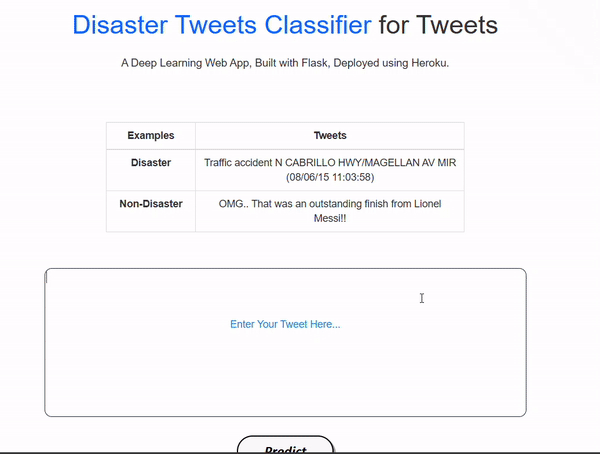
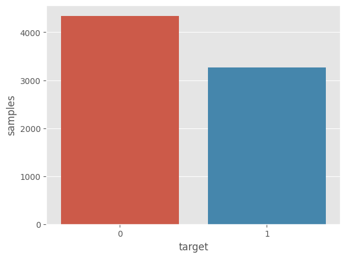
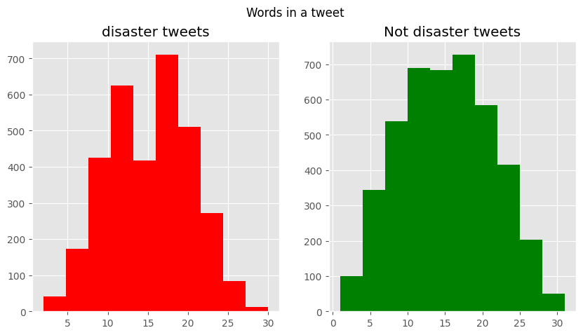
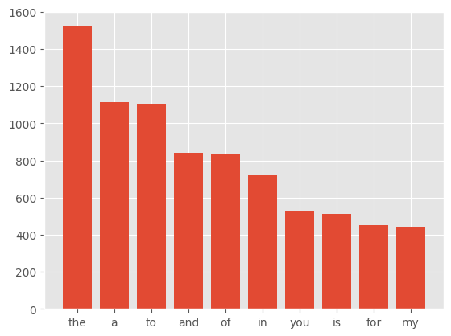
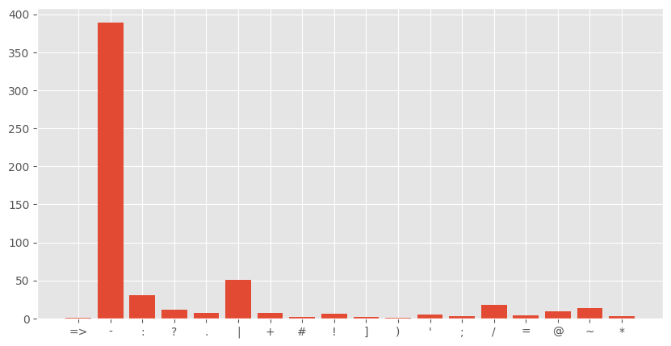
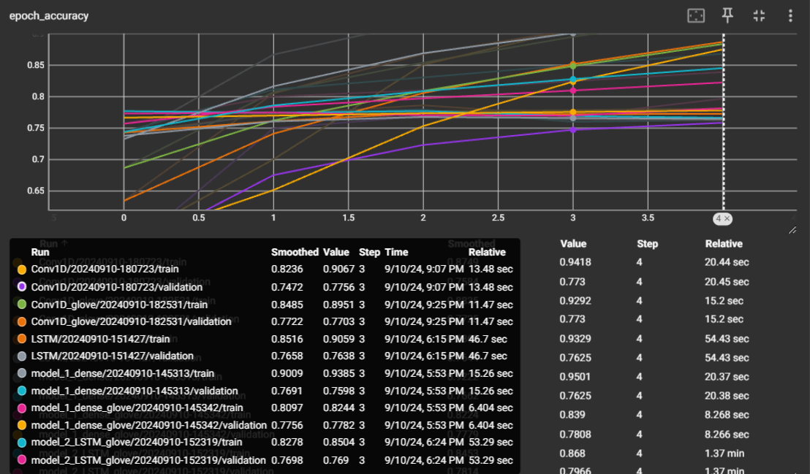
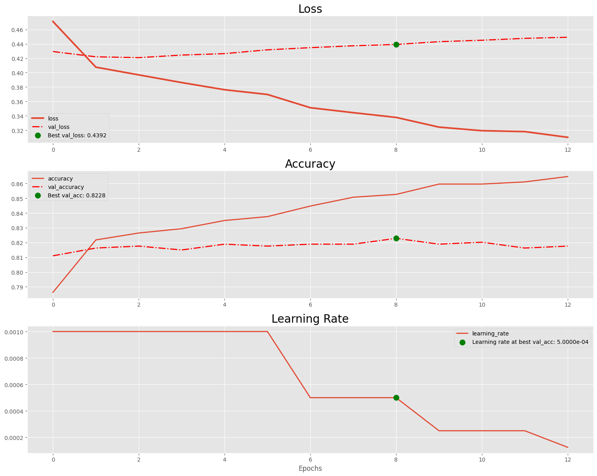

 # Disaster Tweets Analysis and Classification
 Predict which Tweets are about real disasters and which ones are not

  

## Project Description

Twitter has become an important communication channel in times of emergency.   
The ubiquitousness of smartphones enables people to announce an emergency they’re observing in real-time.   
Because of this, more agencies are interested in programatically monitoring Twitter (i.e. disaster relief organizations and news agencies).

- My Notebook at Kaggle:
    https://www.kaggle.com/code/abdelmoneimrehab/baseline-models-use-pretrained-model#Model-4:-Universal-Sentence-Encoder

## Project Contents

1. Exploratory Data Analysis
2. Data Cleaning 
3. Data Preprocessing using NLP
4. Baseline models for classifying Tweets data
5. USE Pretrained Model for classifying Tweets data
6. Model Deployment

## Resources Used
- **Packages** : Pandas, Numpy, Matplotlib, Tensorflow, Scikit-Learn, Keras, Keras-tuner, Nltk etc.
- **Dataset**  : https://www.kaggle.com/c/nlp-getting-started
- **Word Embeddings** : https://www.kaggle.com/danielwillgeorge/glove6b100dtxt

## 1. Exploratory Data Analysis
  
  - **Visualising Target Variable of the Dataset**
 
    
 

  - **Visualising Average word lengths of Tweets**

    

  - **Visualising most common stop words in the text data**

    

  - **Visualising most common punctuations in the text data**

    

## 2. Data Cleaning

### To ensure the text data is clean and ready for modeling, we applied the following preprocessing steps:

    1- Removing URLs: All web links were extracted and removed to eliminate irrelevant information.
    2- Stripping HTML Tags: Any HTML tags present in the text were removed to retain only plain text.
    3- Removing Emojis: Emojis were filtered out to focus on textual content without visual symbols.
    4- Eliminating Punctuation: All punctuation marks were stripped to standardize the text format for analysis.

## 3. Data Preprocessing using NLP

### In preparation for model training, we performed several key preprocessing steps:

- **Tokenization**: The text was tokenized into individual words to facilitate further processing.
- **Embeddings**: We used GloVe embeddings for the initial baseline model and employed TensorFlow's embedding layer for additional experiments.
- **Pretrained Model**: Finally, we applied embeddings from the Universal Sentence Encoder (USE) to enhance model performance. 

## 4. Baseline models for classifying Tweets data

1- **Multinomial Naive Bayes:**

    Used TF-IDF Vectorizer for feature extraction,
    achieving an accuracy of 79.92%.

2- **Simple Dense Layer:**

    Using the Embedding Layer: Achieved 76.5% accuracy.
    Using GloVe Embeddings: Achieved 78.7% accuracy.

3- **LSTM Model:**

    Using the Embedding Layer: Achieved 77.3% accuracy.
    Using GloVe Embeddings: Achieved 78.5% accuracy.

4- **Convolutional 1D (Conv1D):**

    Using the Embedding Layer: Achieved 77.55% accuracy.
    Using GloVe Embeddings: Achieved 78.8% accuracy.

## 5. Deep Learning approach for classifying Tweets data

**Universal Sentence Encoder (USE):**

    Achieved an accuracy of 82.28%.

## 6. Model Deployment

  - Universal Sentence Encoder model obtained from Deep Learning approach is used for deployment
  - Micro Web Framework [Flask](https://flask.palletsprojects.com/) is used to create web app 
  - Render is used to deploy the our Web-app

# Scope of Improvemment

  - We can always use large dataset which covers almost every type of data for both machine learning and deep learning
  - We can use the best pretrained models but they require a lot of computational power
  - Also there are various ways to increase model accuracy like k-fold cross validation, different data preprocessing techniques better than used here

# Conclusion

The Data analysis and modelling was sucessfully done, and the Deep Learning model was deployed on [Render]()

Please do ⭐ the repository, if it helped you in anyway.

